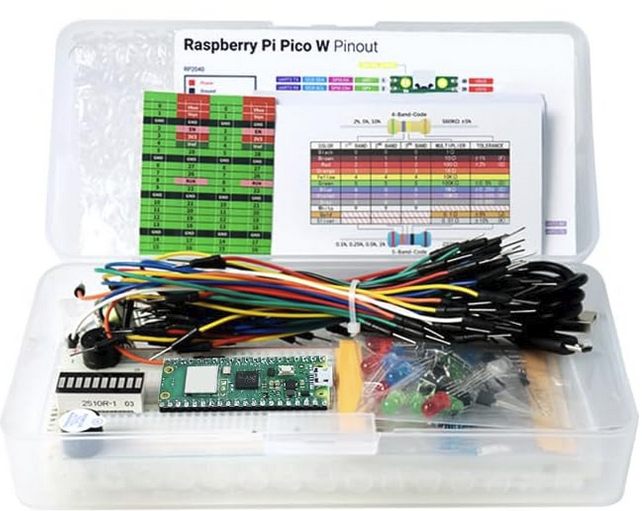
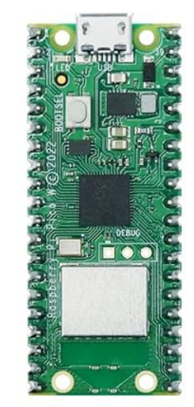
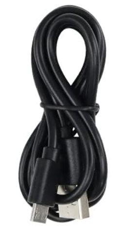
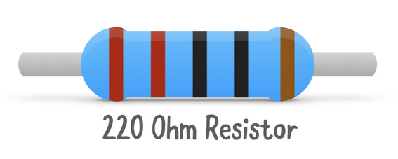
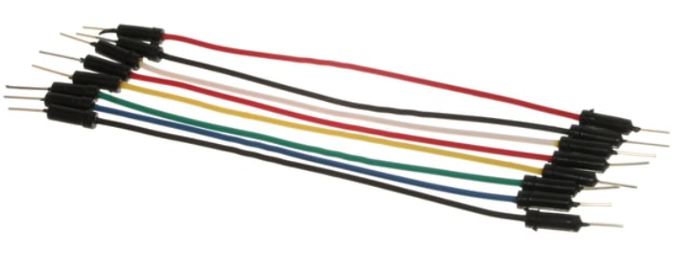
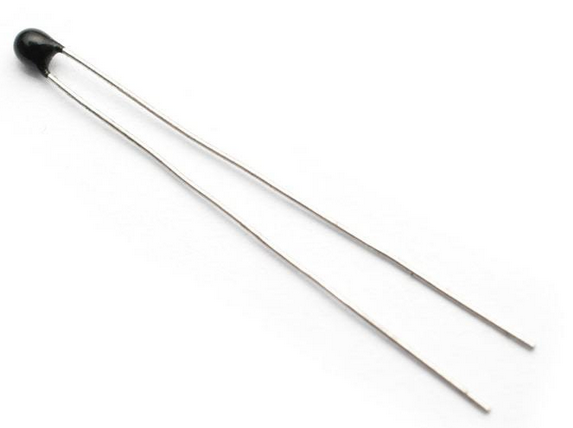
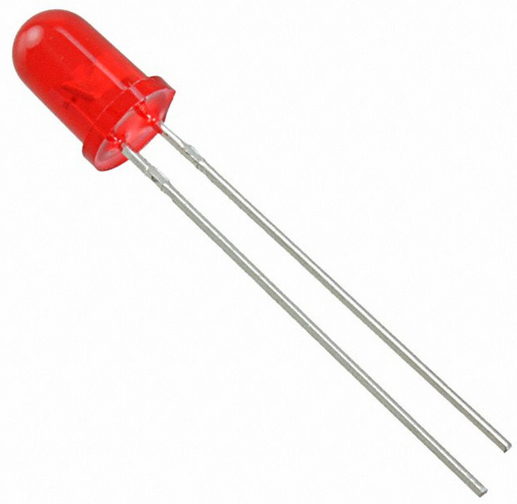

# How to build a simple ambient temperature monitor
**Author:** Miki Lamberg, ml227cr

When I started this project, the initial idea was to monitor the household temperature, since the ambient temperature in my household can significantly vary during summer and massively impact the proofing of my pizza doughs. I began with a basic starter kit that included a thermistor, an _analog sensor_, rather than something like a _digital_ DHT11 (which measures temperature and humidity), deeming it redundant for my end purposes. I simply wanted a temperature monitor which would ping me if the temperature went below or above X or Y degrees, allowing me to take appropriate measures for the pizza dough (e.g. placing it in the fridge if too warm, or opposite if too cold).

However, as the project progressed, I realized I wanted more than just ambient temperature readings — I wanted to monitor the actual temperature of the dough itself. Reading the temperatures of the dough would make for
1) more accurate readings, as the dough temperature is impacted by kneading and our body temperature,
2) and I already have a household thermometer which clearly displays the ambient temperature

Ultimately, I bought a DS18B20 (see [# Material](#material)) digital sensor for this purpose.

With either the thermistor (analog) or DS18B20 (digital), building this monitor using this tutorial should take approximately 15–20 hours.

# Objective

_(Coming soon)_

# Material
The following items were used in this project. I've included the base kit as a whole, but also the individual components that I actually used from that base kit. How they were used will follow in chapters below.

| Component                                                                                                                         | Image                                                 | Description                                                      | Cost                |
|-----------------------------------------------------------------------------------------------------------------------------------|-------------------------------------------------------|------------------------------------------------------------------|---------------------|
| 1x [Freenove Basic Starter Kit](https://www.amazon.se/Freenove-Raspberry-Dual-core-Cortex-M0-Microcontroller/dp/B0BJ1QC6X8/?th=1) |       | Starter kit including the Microcontroller and various components | ~360 SEK            |
| 1x Raspberry Pi Pico W                                                                                                            |            | Microcontroller (MCU) with Wi-Fi enabled                         | *incl. in base kit* |
| 1x USB-A to Micro-USB Cable                                                                                                       |         | USB cable between MCU and PC                                     | *incl. in base kit* |
| 1x 220Ω Resistor                                                                                                                  |    | Current-limiting resistor for optional LED                       | *incl. in base kit* |
| 1x 10kΩ Resistor                                                                                                                  |    | Used in voltage divider with thermistor                          | *incl. in base kit* |
| x Jumper Wires                                                                                                                    |      | Used to connect components on the breadboard                     | *incl. in base kit* |
| 1x Thermistor                                                                                                                     |        | Analog temperature sensor                                        | *incl. in base kit* |
| 1x LED (*optional*)                                                                                                               |               | Red LED for visual debugging (e.g., temperature alert)           | *incl. in base kit* |

# Computer setup

_(Coming soon)_

# Putting everything together

_(Coming soon)_

# Platform

_(Coming soon)_

# The code

_(Coming soon)_

# Transmitting the data / connectivity

_(Coming soon)_

# Presenting the data

_(Coming soon)_

# Finalizing the design

_(Coming soon)_

