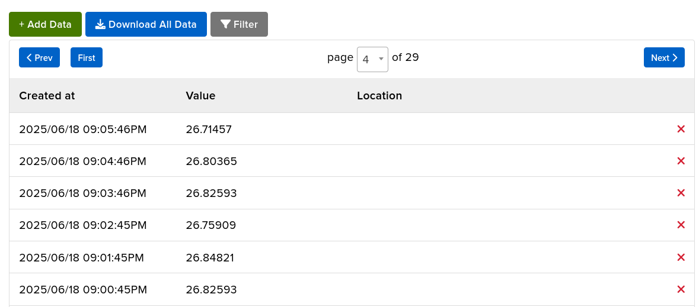

# How to build a simple ambient temperature monitor
**Author:** Miki Lamberg, ml227cr

When I started this project, the initial idea was to monitor the household temperature, since the ambient temperature in my household can significantly vary during summer and massively impact the proofing of my pizza doughs. I began with a basic starter kit that included a thermistor, an _analog sensor_, rather than something like a _digital_ DHT11 (which measures temperature and humidity), deeming it redundant for my end purposes. I simply wanted a temperature monitor which would ping me if the temperature went below or above X or Y degrees, allowing me to take appropriate measures for the pizza dough (e.g. placing it in the fridge if too warm, or opposite if too cold).

With either a thermistor or DS18B20 [(more on this in Objective)](#objective), building this monitor using this tutorial should take approximately 10–15 hours.

P.S. If any term is unfamiliar to you, please refer to the [Glossary](#glossary).


# Objective

As mentioned in the project overview, the initial objective was to create a sensor that monitors the ambient temperature where my pizza dough usually rests (the kitchen), and ping me on Discord if the temperature reaches a certain threshold so I could take the appropriate action. This would allow me to be do other things and not constantly worry about the fluctuating temperature - I would instead receive pings via the Discord application on my mobile phone.

However, as the project progressed, I realized I would possibly need more accurate readings of the dough temperature, rather than the ambient temperature. This led to discussions with a TA who recommended a DS18B20, a *digital*, food-safe temperature probe that I would insert into the dough for more accurate readings. I did not pursue this because of other priorities at the time, but it might be something worth trying in the future.

# Material
I chose the Basic Starter Kit by Freenove as recommended by the course management. Seeing as it was my first encounter with this kind of tech, I found it reasonable.
The following items were used in this project. I've included the starter kit as a whole, but also the individual components that I actually used from that base kit. How they were used will follow in chapters below. Buying the components individually would cost much less than the starter kit, if the sole purpose is to copy this project.

| Component                                                                                                                         | Image                                                 | Description                                                      | Cost                |
|-----------------------------------------------------------------------------------------------------------------------------------|-------------------------------------------------------|------------------------------------------------------------------|---------------------|
| 1x [Freenove Basic Starter Kit](https://www.amazon.se/Freenove-Raspberry-Dual-core-Cortex-M0-Microcontroller/dp/B0BJ1QC6X8/?th=1) |       | Starter kit including the Microcontroller and various components | ~360 SEK            |
| 1x Raspberry Pi Pico W                                                                                                            |            | Microcontroller (MCU) with Wi-Fi enabled                         | *incl. in starter kit* |
| 1x USB-A to Micro-USB Cable                                                                                                       |         | USB cable between MCU and PC                                     | *incl. in starter kit* |
| 1x 220Ω Resistor                                                                                                                  |    | Current-limiting resistor for optional LED                       | *incl. in starter kit* |
| 1x 10kΩ Resistor                                                                                                                  |    | Used in voltage divider with thermistor                          | *incl. in starter kit* |
| x Jumper Wires                                                                                                                    |      | Used to connect components on the breadboard                     | *incl. in starter kit* |
| 1x Thermistor                                                                                                                     |        | Analog temperature sensor                                        | *incl. in starter kit* |
| 1x LED (*optional*)                                                                                                               |               | Red LED for visual debugging (e.g., temperature alert)           | *incl. in starter kit* |


# Computer setup

### Setting up the Pico

Before anything, the Pico needs to be flashed with MicroPython firmware. You can download the latest firmware (v.1.25.0 as of 18/6-2025) [here](https://micropython.org/download/RPI_PICO_W/). Follow these steps to flash the firmware:

1. Hold the BOOTSEL button on your Raspberry Pi Pico.

2. While holding the button, plug the Pico into your computer via USB.

3. The Pico should appear as a removable USB drive named RPI-RP2 which is the Pico storage.

4. Drag and drop the downloaded .uf2 firmware file onto this USB drive.

5. After a few seconds, the Pico will automatically reboot — the drive will disappear, indicating that the firmware was successfully installed.

6. To confirm the board is ready, unplug and plug the Pico back in - it should no longer show up as a USB drive. Done!

---

### Setting up for a Linux environment (Ubuntu 20.04/22.04/24.04) with Visual Studio Code

This guide works for Ubuntu and most Debian-based Linux distributions.

### Step 1: Install Node.js, npm and Python

Open your terminal and run:
```
sudo apt update && sudo apt upgrade -y
sudo apt install -y nodejs npm
```

Check if Node.js and npm were correctly installed:
```
node --version
npm --version
```

You should see numbers like `v22.xx.x` and `10.x.x`.

You'll also need Python and the package manager `pip`.
```
sudo apt install python3-pip
sudo pip3 install --upgrade pip
```
This ensures you have the latest version of `pip` to install any required Python tools.


### Step 2: Install Visual Studio Code

If VS Code is not yet installed on your machine, download it via the official .deb installer [here](https://code.visualstudio.com/Download).

Run the installer (double-click the .deb file) or use the terminal with the following command, assuming the file is in the Downloads folder:
```
sudo dpkg -i ~/Downloads/code_*.deb
```

Once installed, open Visual Studio Code. If it was already open, restart it so it can detect Node.js and other installed tools and packages.

### Step 3: Install the MicroPico extension in VS Code

The MicroPico extension provides auto-completion, REPL access, and workspace integration for Raspberry Pi Pico boards running MicroPython.

1. Open Visual Studio Code

2. Go to the Extensions view (or press Ctrl+Shift+X)

3. Search for: "MicroPico" and install the extension by "paulober" (as of 18/6-2025)


Once installed, make sure the Pico is plugged in and then:

1. Press `CTRL + SHIFT + P` to open the Command Palette

2. Type "MicroPico: Connect" and press `Enter`

2. A MicroPico REPL shell will open — your Pico is now connected!

To test the connection, type the following in the shell:

```print("Hello from Pico!")```

Done!

# Putting everything together

### Glossary


| **Term**       | **Definition**                                                                                  |
|----------------|-----------------------------------------------------------------------------------------------|
| **Breadboard**  | A plastic board that does not require soldering. A variety of electronic systems can be prototyped this way. |
| **Physical pin**| The actual numbered pin location on the MCU.                                                  |
| **Anode**       | The longer leg of an LED; connects to positive voltage.                                       |
| **Cathode**     | The shorter leg of an LED; connects to ground.                                                |
| **ADC (Analog-to-Digital Converter)** | A pin that can read varying voltages, converting them into digital values.        |
| **Thermistor**  | A special resistor that changes how much it "resists" electricity based on the temperature changes. These changes in resistance can later be converted to an actual temperature in, say, Celsius degrees. |

---

My wiring here is minimal on purpose, I prioritized to make a simple construction that I'd understand within my limited timeframe.

I should add that the LED and button can be tested independently (using power and ground); meaning they don't need to be connected to an MCU as I do in this tutorial.


#### Step 1. Connect the LED

To prevent the LED receiving too much power via the GP0 pin (3.3V by default) a resistor has to be connected, regulating the current flowing to the LED.

* Connect the anode (long leg) of the LED to GP0, which is physical pin 1 on the Pico.

* Connect the cathode (short leg) to the negative rail of the breadboard.
    * The rail acts as a shared ground point.

* Connect one end of the 220 ohm resistor to the same negative rail, adjacent to the cathode of the LED, and the other end to GND, which is physical pin 3 of the Pico.
    * The resistor is now adjacent to both ends of the LED and it controls the current flowing through to LED to prevent delivering too much voltage.


#### Step 2. Add a button (Optional)
You can add a button if you want to interact with your gathering of data — for example, to start/stop readings or record data only on press.

In my case, I chose continuous temperature readings, so the button was just an experimental detour for learning purposes.

The button itself is plugged in centrally on the board, connected to the Pico with two jumpers wires - one to GP15 and one to GND, physical pins 20 and 18 respectively. That's it. In code you can then manipulate what a button press does, e.g. record the temperature.


#### Step 3. Add the temperature sensor, thermistor.
Now it is time to add a thermistor on the breadboard which is regulated by another resistor, this time a 10k ohm one and three jumper wires.

* Connect the thermistor to the opposite side of the LED on the breadboard.
* Connect a jumper wire (yellow in my circuit) on the same rail as the thermistor, and then plug the other end in on GP26, physical pin 31.
* Connect another jumper wire (black in my circuit) to the same rail as the other leg of the thermistor (refer to the picture below) and then plug the other end in on GND, physical pin 23.
* Connect a third and final jumper wire (red in my circuit) to 3V3(OUT), physical pin 36. Connect the other end somewhere on the same rail as the previous two jumper wires.
* Lastly, plug the 10k ohm resistor on the breadboard so that one end is on the same rail as the 3V3(OUT)-jumper wire, and the other on the same rail as the thermistor and jumper wire which is connected to the GP26 (ADC) port on the Pico.

GP26 on the Pico reads the voltage input from the thermistor, converts it to a digital value (since it's an ADC port) and the rest is handled on code side.


#### Step 4. Final circuit, no button
This is the end result, with the resistor color code and pinout chart available.
The button has been removed because it serves no purpose in my project.


# Platform

For this project, I chose **Adafruit** because of its simplicity and beginner-friendly UI. I didn’t have much time to create an elaborate setup, so I aimed for a stable, easy-to-replicate solution. No complex configuration was necessary.

The free tier of Adafruit offers more than enough features for this project's purpose. Here are a few key features that convinced me that Adafruit was an excellent choice of platform for my needs:

* Up to 10 feeds
* Built-in alert system and webhook integrations (more on this below)
* Cloud-hosted data feed (no local server needed)
* MQTT support for the Raspberry Pi Pico W and MicroPython
* Visual dashboard with charts, sliders, buttons etc.

The course guide also provided a great example of how to send events from Adafruit to Discord using a webhook. I adopted this method to create an alert system that notifies me via Discord when the ambient temperature reaches a certain threshold. This allows me to take action even when I’m not in the kitchen where the dough is proofing.

All of this made Adafruit a solid choice — quick to set up, beginner-friendly, and powerful enough to make this small beginner-project possible.

# The code

While I had some experience with Python since before, the whole IoT-aspect including electronics made me want to be cautious because im a super rookie when it comes to hardware and electricity.

With that in mind, I don't want to exaggerate something that in it's essence is **very** simple, so here goes.


This is main function. The function is responsible for reading the ambient temperature, converting it to celcius degrees and finally sending converted value to Adafruit where it is registered and stored.
```python
def send_temperature():
    raw_value = thermistor_pin.read_u16() # raw value read as millivolts
    temperature = adc_to_celsius(raw_value) # converts millivolts to Celsius degrees
    print(f"Sending temperature to Adafruit feed: {temperature} Celcius degrees")
    client.publish(keys.AIO_TEMPS_FEED, str(temperature)) # send message as string payload to conform to MQTT message policy

    # Flash LED briefly to visually indicate that data has been transferred
    led.on()
    time.sleep(0.5)
    led.off()
```

The conversion is handled by the helper function adc_to_celsius(), which takes the raw thermistor reading as input. This function uses the Beta parameter equation, a simplified form of the Steinhart-Hart equation, to convert the ADC (Analog-To-Digital Converter) value into temperature in Celsius by calculating the thermistor's resistance and then estimating the temperature.

```python
# Constants
BETA = 3950
KELVIN_CONSTANT = 273.15

# ADC conversion function to give Celsius
def adc_to_celsius(x):
    return (1 / (log(1 / (65535 / x - 1)) / BETA + 1 / 298.15) - KELVIN_CONSTANT)
```

# Transmitting the data / connectivity

The data, in my case temperature readings, is transmitted to the internet, specifically https://io.adafruit.com via Wi-Fi and the MQTT-protocol.

During the course the data has been sent in intervals of 30-60 seconds.

If the threshold in my personal code has been exceeded, e.g. ambient temperature of >=24 then a message has been sent to me on Discord, alerting me that that is the case. This is done via a webhook as described in [this guide](https://hackmd.io/@lnu-iot/r1yEtcs55#Webhooks-in-Adafruit-and-sending-messages-to-the-Discord-server) provided by the course.

# Presenting the data

Below you can see a standard line chart and feed data with typical attributes such as 'data', 'created at' and the possibility to add, download and filter data.
As I mentioned in [#Transmitting the data / connectivity](#Transmitting-the-data-/-connectivity), the data has been collected in intervals of 30-60 seconds, currently set to a fixed 30 seconds.

At the time of writing this the data stored is 314kb large. The data history is not particularly important to me, as long as new data can overwrite the old one and keep me alerted via the webhook, then nothing needs to be adressed.

Adafruit stores the data for 30 days in the free tier, and there is no risk of exceeding the data cap for this type of data.





# Finalizing the design and conclusion

At this point I've provided many pictures throughout the process, and a finalized circuit in [#Putting everything together](#Putting-everything-together).

The visualized data can be seen in the above chapter, so all that is left is a conclusion and screen shots of the trigger and action-event, along with a friendly message from Tempy, the Temperature Bot.

What's next?

After this experience I want to create an automated watering system for my parents in law. I believe this project paved the way for future endeavours in the field. While not entirely IoT-related, I am very curious about soldering and building my own keyboard, specifically with a MCU like the RP2040 I've used here.


